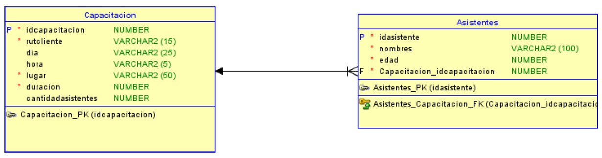
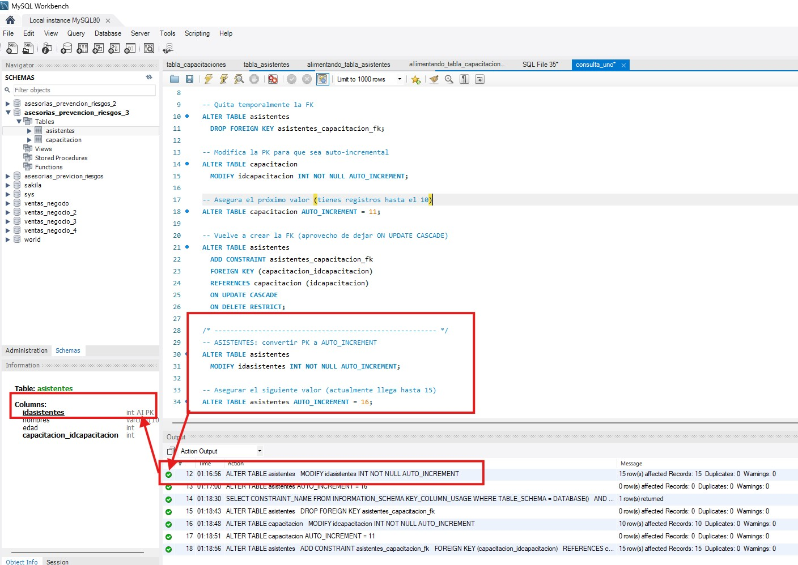
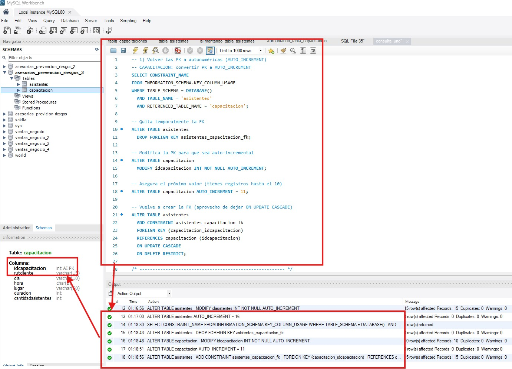
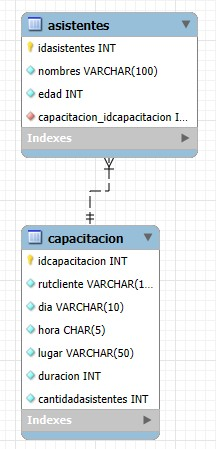

**_<h1 align="center">:vulcan_salute: Base de Datos Asesorias Prevencion Versión 2 :computer:</h1>_**


**<h3>:blue_book: Contexto de la Actividad:</h3>**

<p>Una empresa de asesorías en prevención de riesgos necesita contar con un sistema de información que le permita administrar los principales procesos que se llevan a cabo en ella día a día.</p>
<p>En la unidad anterior, una de las clases más reconocidas fue la clase “Capacitacion”, la que se podía estar asociada a uno o varios asistentes a la instancia. Un modelo de datos que representa esta realidad es el siguiente:</p>



**<h3>:orange_book: Requerimientos:</h3>**

<p>Realice las siguientes consultas sobre la tabla:</p>
<ul>
    <li>1. Haga las consultas necesarias para convertir las llaves primarias de cada tabla en campos autonuméricos.</li>
    <li>Genere 3 consultas que permitan ingresar datos sobre la tabla Capacitación, sin asignar el campo idcapacitacion en la consulta misma.</li>
    <li>Genere 5 consultas que permitan ingresar datos sobre la tabla Asistentes, sin asignar el campo idasistente en la consulta misma.</li>
    <li>Realice una consulta que permita establecer una restricción de tipo única sobre el campo nombres de la tabla Asistentes.</li>
    <li>Realice una consulta que permita actualizar los campos dia a “01/01/2020” y hora a “00:00” de la tabla capacitación, para todos aquellos registros tales que el día y la hora son igual a un valor nulo.</li>
    <li>Realice una consulta que permita eliminar todas aquellas capacitaciones que no tienen asistentes. Esto es, aquellas capacitaciones con el campo cantidadasistentes igual a 0, y sin registros relacionados en la tabla.</li>
</ul>

**<h3>:green_book: Construcción de la Base de Datos:</h3>**

<p>Creando la base de datos con las tablas ventas y clientes:</p>

```SQL
CREATE TABLE capacitacion (
	idcapacitacion INT NOT NULL PRIMARY KEY,
  rutcliente VARCHAR(15) NOT NULL CHECK (rutcliente REGEXP '^[0-9]{7,8}-[1-9kK]{1}$'),
  dia VARCHAR(10) NOT NULL,
  hora CHAR(5) NOT NULL CHECK (hora REGEXP '^[0-2][0-9]:[0-5][0-9]'),
  lugar VARCHAR(50) NOT NULL,
  duracion INT NOT NULL,
  cantidadasistentes INT NOT NULL
);

CREATE TABLE asistentes (
	idasistentes INT NOT NULL PRIMARY KEY,
  nombres VARCHAR(100) NOT NULL,
  edad INT NOT NULL,
  capacitacion_idcapacitacion INT NOT NULL
);
    
ALTER TABLE asistentes
ADD CONSTRAINT asistentes_capacitacion_fk 
FOREIGN KEY ( capacitacion_idcapacitacion )
REFERENCES capacitacion ( idcapacitacion );
```

<p>Alimentando tabla capacitacion:</p>

```SQL
INSERT INTO capacitacion (idcapacitacion, rutcliente, dia, hora, lugar, duracion, cantidadasistentes) 
VALUES
	(1, '12345678-9', 'Lunes', '09:00', 'Santiago Centro', 60, 25),
	(2, '98765432-K', 'Martes', '10:30', 'Providencia', 45, 15),
	(3, '11223344-5', 'Miércoles', '14:00', 'Las Condes', 90, 40),
	(4, '55667788-2', 'Jueves', '16:15', 'La Florida', 30, 12),
	(5, '33445566-K', 'Viernes', '08:45', 'Ñuñoa', 120, 60),
	(6, '77889900-1', 'Sábado', '11:00', 'Vitacura', 50, 20),
	(7, '44556677-3', 'Domingo', '15:30', 'Maipú', 75, 18),
	(8, '22334455-4', 'Lunes', '13:00', 'Peñalolén', 40, 8),
	(9, '99887766-K', 'Miércoles', '09:45', 'San Bernardo', 110, 35),
	(10, '66778899-7', 'Viernes', '17:00', 'Puente Alto', 55, 22);
```

<p>Alimentando tabla asistentes:</p>

```SQL
INSERT INTO asistentes (idasistentes, nombres, edad, capacitacion_idcapacitacion) 
VALUES
	(1, 'Carlos Muñoz', 28, 1),
	(2, 'Fernanda Soto', 35, 1),
	(3, 'Luis Herrera', 42, 2),
	(4, 'Valentina Rojas', 31, 2),
	(5, 'Jorge Martínez', 27, 3),
	(6, 'Camila González', 24, 3),
	(7, 'Rodrigo Pérez', 39, 4),
	(8, 'Paula Contreras', 33, 5),
	(9, 'Andrés Silva', 29, 5),
	(10, 'Daniela Torres', 26, 6),
	(11, 'Matías Fuentes', 37, 7),
	(12, 'María López', 41, 8),
	(13, 'Sebastián Vega', 30, 9),
	(14, 'Claudia Pizarro', 34, 10),
	(15, 'Ignacio Fernández', 32, 10);
```

**<h3>📁 Estructura del Proyecto:</h3>**

```
📁asesorias_prevencion_riesgos_2
├── README.md
└── 📁img
│    ├── 📁wireframes
│    │   └── wireframe_bbdd.jpg
│    ├── consulta_uno.jpg
│    ├── consulta_dos.jpg
│    ├── consulta_tres.jpg
│    ├── consulta_cuatro.jpg
│    ├── consulta_cinco.jpg
│    └── eer_diagram.jpg
└── 📁mysql
    ├── 📁consultas
    │   ├── consulta_uno.sql
    │   ├── consulta_dos.sql
    │   ├── consulta_tres.sql
    │   ├── consulta_cuatro.sql
    │   └── consulta_cinco.sql
    ├── 📁tabla_capacitaciones
    │   ├── creando_tabla_capacitacion.sql
    │   └── ingresando_datos_tabla_capacitacion.sql
    └── 📁tabla_asistentes
        ├── creando_tabla_asistentes.sql
        └── ingresando_datos_tabla_asistentes.sql
```

**<h3>:blue_book: Consultas ejecutadas:</h3>**

1. Volver las PK a autonuméricas (AUTO_INCREMENT):

```SQL
-- CAPACITACION: convertir PK a AUTO_INCREMENT
SELECT CONSTRAINT_NAME
FROM INFORMATION_SCHEMA.KEY_COLUMN_USAGE
WHERE TABLE_SCHEMA = DATABASE()
  AND TABLE_NAME = 'asistentes'
  AND REFERENCED_TABLE_NAME = 'capacitacion';

-- Quita temporalmente la FK
ALTER TABLE asistentes
  DROP FOREIGN KEY asistentes_capacitacion_fk;

-- Modifica la PK para que sea auto-incremental
ALTER TABLE capacitacion
  MODIFY idcapacitacion INT NOT NULL AUTO_INCREMENT;

-- Asegura el próximo valor (tienes registros hasta el 10)
ALTER TABLE capacitacion AUTO_INCREMENT = 11;

-- Vuelve a crear la FK (aprovecho de dejar ON UPDATE CASCADE)
ALTER TABLE asistentes
  ADD CONSTRAINT asistentes_capacitacion_fk
  FOREIGN KEY (capacitacion_idcapacitacion)
  REFERENCES capacitacion (idcapacitacion)
  ON UPDATE CASCADE
  ON DELETE RESTRICT;

/* -------------------------------------------------------- */
-- ASISTENTES: convertir PK a AUTO_INCREMENT
ALTER TABLE asistentes
  MODIFY idasistentes INT NOT NULL AUTO_INCREMENT;

-- Asegurar el siguiente valor (actualmente llega hasta 15)
ALTER TABLE asistentes AUTO_INCREMENT = 16;
```




2. 3 INSERT en capacitacion SIN indicar idcapacitacion

```SQL
INSERT INTO capacitacion (rutcliente, dia, hora, lugar, duracion, cantidadasistentes)
VALUES ('11111111-1', 'Lunes', '12:30', 'Quilicura', 50, 14);

INSERT INTO capacitacion (rutcliente, dia, hora, lugar, duracion, cantidadasistentes)
VALUES ('22222222-2', 'Martes', '18:00', 'Independencia', 75, 28);

INSERT INTO capacitacion (rutcliente, dia, hora, lugar, duracion, cantidadasistentes)
VALUES ('33333333-3', 'Jueves', '07:45', 'La Reina', 40, 9);
```


3. 5 INSERT en asistentes SIN indicar idasistentes

```SQL
INSERT INTO asistentes (nombres, edad, capacitacion_idcapacitacion)
VALUES ('Tomás Núñez', 25, 1);

INSERT INTO asistentes (nombres, edad, capacitacion_idcapacitacion)
VALUES ('Francisca Araya', 36, 3);

INSERT INTO asistentes (nombres, edad, capacitacion_idcapacitacion)
VALUES ('Pablo Cáceres', 29, 5);

INSERT INTO asistentes (nombres, edad, capacitacion_idcapacitacion)
VALUES ('Josefa Medina', 33, 7);
```


4. Restricción única sobre nombres en asistentes

```SQL
ALTER TABLE asistentes
  ADD CONSTRAINT asistentes_nombres_uk UNIQUE (nombres);
```


5. Actualizar dia y hora cuando ambos son NULL

```SQL
UPDATE capacitacion
SET dia = '01/01/2020',
    hora = '00:00'
WHERE dia IS NULL
  AND hora IS NULL;
```


6. Eliminar capacitaciones sin asistentes (y con cantidadasistentes = 0)

```SQL
-- previsualizar lo que se va a borrar:
SELECT c.idcapacitacion, c.dia, c.hora, c.lugar
FROM capacitacion AS c
LEFT JOIN asistentes AS a
  ON a.capacitacion_idcapacitacion = c.idcapacitacion
WHERE c.cantidadasistentes = 0
  AND a.idasistentes IS NULL;

-- borrar usando la PK idcapacitacion dentro del WHERE
DELETE FROM capacitacion
WHERE idcapacitacion IN (
  SELECT idcapacitacion
  FROM (
    SELECT c.idcapacitacion
    FROM capacitacion AS c
    LEFT JOIN asistentes AS a
      ON a.capacitacion_idcapacitacion = c.idcapacitacion
    WHERE c.cantidadasistentes = 0
      AND a.idasistentes IS NULL
  ) AS t
);
```


**<h3>:book: EER Diagram:</h3>**


